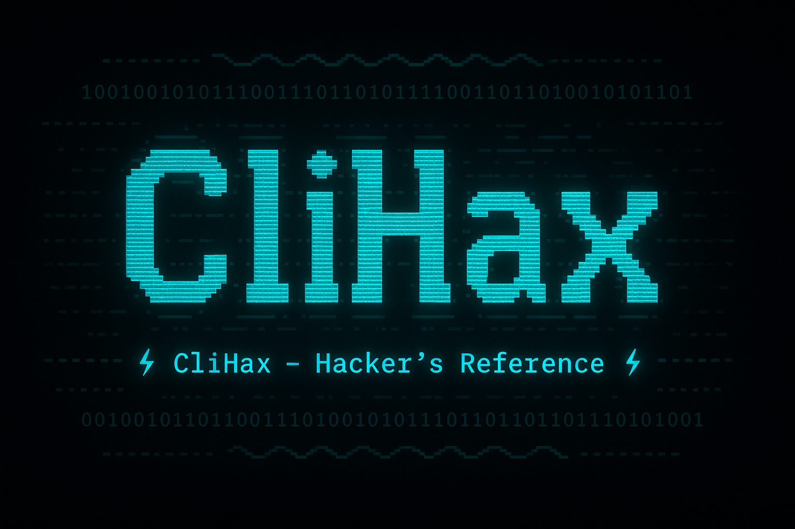

# ⚔️ CliHax

<p align="center">
  
</p>

> A command-line tool for hackers and pentesters to manage and recall tool syntax, flags, and notes — right from the terminal.

[](LICENSE)
[](https://www.python.org/)
[](https://github.com/Harikrishnan-P97/clihax)
[](https://github.com/Harikrishnan-P97/clihax/commits)
[](https://github.com/Harikrishnan-P97/clihax/issues)
[](https://github.com/Harikrishnan-P97/clihax/stargazers)
[](https://github.com/Harikrishnan-P97/clihax/actions)

---

## 📚 Overview

**CliHax** is a Python-based CLI utility designed for ethical hackers, red teamers, bug bounty hunters, and CTF players who want to **organize, search, and recall tool syntax and notes quickly**.

Instead of Googling commands every time, create your own searchable, shareable command reference from the terminal.

---

📒 [Changelog](CHANGELOG.md)

---

## ✨ Features

- ✅ Add, edit, delete tools with syntax and descriptions
- 🔍 Search tools by keyword or filter by tags/category
- 🏷️ Tag tools by hacking phase (e.g., recon, exploit)
- 📋 Copy command syntax directly to your clipboard
- 🌈 Styled output with [Rich](https://github.com/Textualize/rich)
- 🔁 Git-sync friendly (for team sharing or backups)
- 💾 JSON-based persistent storage
- 🧠 Import/export entire tool DB
- ⚡ Quick mode (`--quick`) for silent terminal use
- 🔐 Drop tool database with auto-backup and action logs

---

## 📦 Requirements

- **Python** `3.10+`
- **Poetry** (for dependency & virtualenv management)

### 🔧 Install Dependencies

```bash
poetry install
```

Or if you prefer pip:

```bash
pip install -r requirements.txt  # Optional if you export a requirements file
```

---

## 🚀 Getting Started

### 📂 Clone the Repo

```bash
git clone https://github.com/Harikrishnan-P97/clihax.git
cd clihax
poetry install
```

### 🛠️ Troubleshooting

For detailed setup help and solutions to common issues, check the [Troubleshooting Guide](docs/troubleshooting.md).

### 🏃 Run the CLI

```bash
poetry run clihax --help
```

You’ll see:

```
Usage: clihax [OPTIONS] COMMAND [ARGS]...

  CliHax - A command reference manager for hackers and pentesters.
```

---

## 🔧 Core Commands

| Command              | Description                                  |
|----------------------|----------------------------------------------|
| `add`                | Add a new tool with command and notes        |
| `list`               | View all tools in a Rich-styled table        |
| `show <index>`       | Display a specific tool's full info          |
| `edit <index>`       | Modify an existing tool entry                |
| `delete <index>`     | Remove a specific tool                       |
| `search <term>`      | Search by keyword                            |
| `searchfilter <tag>` | Filter tools by tag or category              |
| `export <file>`      | Export your database to a JSON file          |
| `import <file>`      | Import tools from a JSON file                |
| `drop`               | Delete all tools (with confirmation & backup)|
| `logs`               | View or clear drop history                   |

---

## 🖼️ Example Tool Entry

```json
{
  "tool": "nmap",
  "command": "nmap -sV <target>",
  "category": "recon",
  "description": "Scan open ports and service versions",
  "tags": ["nmap", "scan", "version"]
}
```

---

## 📁 Project Structure

```
CliHax/
├── assets/                  # Logo/banner images for README
│   └── clihax-bannerimage.png
│
├── backups/                 # Auto-backups before database drops
│
├── clihax/                  # Main source code
│   ├── cli.py               # CLI entry point (Click-based)
│   ├── tools/               # Git sync and tool handlers
│   └── utils/               # JSON helpers and utilities
│
├── data/                    # JSON database and metadata
│   └── tools.json
│
├── docs/                    # Markdown documentation
│   └── troubleshooting.md
│
├── logs/                    # Drop action logs
│   └── drops.json
│
├── .github/workflows/       # GitHub Actions CI/CD
│   └── main.yml
│
├── .gitignore
├── LICENSE                  # MIT License
├── README.md
├── CHANGELOG.md             # Version history
├── pyproject.toml           # Poetry project configuration
└── poetry.lock              # Locked dependencies

```

---

## 🧪 Example Usage

```bash
poetry run clihax add
poetry run clihax search nmap
poetry run clihax show 2 --copy
poetry run clihax export mybackup.json
poetry run clihax drop
```

---

## 🔐 Drop & Backup System

- Drops are **logged** with timestamps to `logs/drops.json`
- Backups are **auto-saved** in `backups/` before mass deletion
- View logs with: `clihax logs`
- Clear logs: `clihax logs --clear`

---

## 🎯 Ideal For

- 🛡️ Penetration testers
- 🧠 Bug bounty hunters
- 🧪 CTF players
- 🧰 Red teamers
- 👨‍🎓 Cybersecurity students

---

## 📜 License

This project is licensed under the [MIT License](LICENSE).

---

## 👤 Author

Made with 💻 and 🧠 by [Harikrishnan](https://github.com/Harikrishnan-P97)

> _"Hack smart. Document smarter."_ — CliHax

